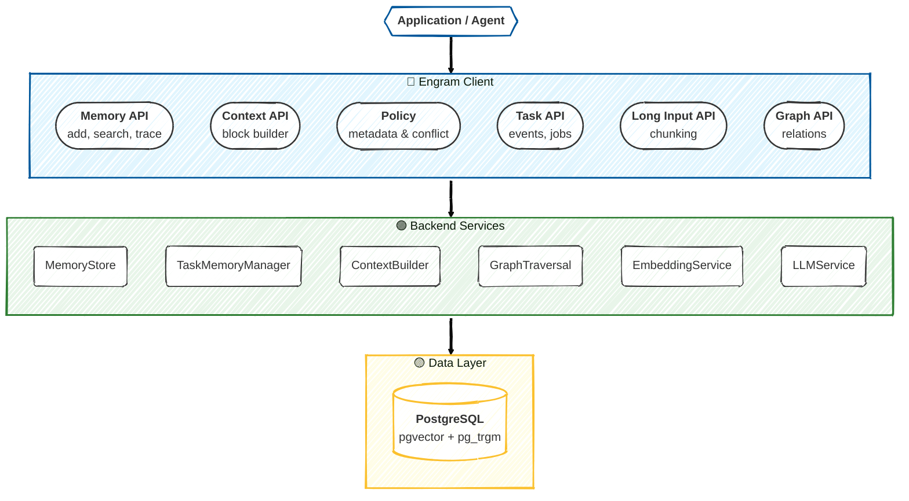
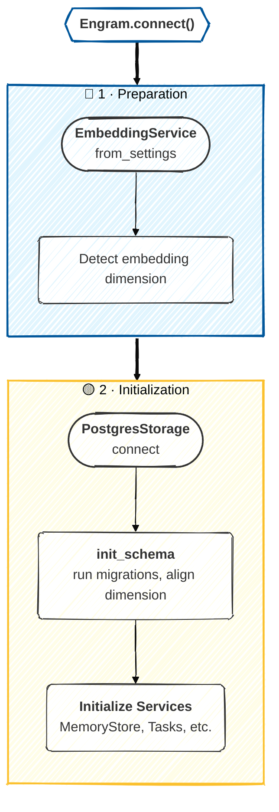
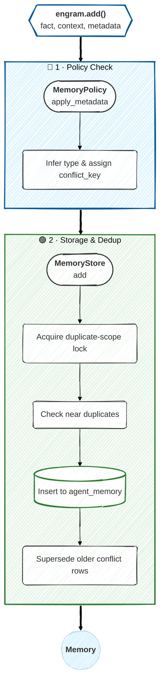
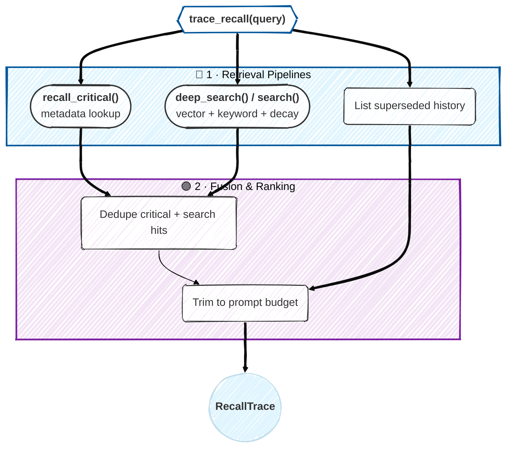
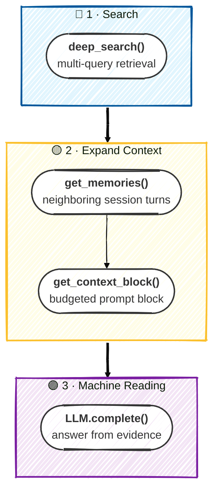
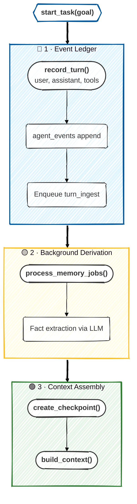
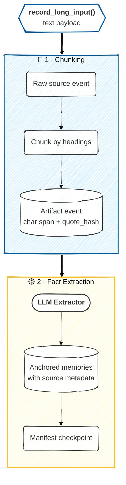

# Architecture

Engram is an async Python memory layer backed by PostgreSQL + pgvector. The
current alpha architecture is built for persistent fact memory, source-aware
long-input handling, graph expansion, and resumable long-running task state.

## System View

## Design Choices

| Decision | Reason |
|----------|--------|
| PostgreSQL as the required store | ACID writes, vector search, full-text search, JSONB, recursive CTEs |
| Two-column memories | embed compact facts and preserve source context without extra embedding cost |
| Policy metadata | critical facts and conflicts need deterministic retrieval rules |
| Append-oriented event ledger | long-running agents need auditability and replayable context |
| Checkpoints | resuming a task should not require replaying every raw event |
| Durable memory jobs | fact derivation can be decoupled from the user-facing turn |
| Recall traces | missed retrievals must be diagnosable |
| Evidence APIs | aggregation questions need diverse coverage, not only top-k relevance |

## Component Responsibilities

### `Engram`

`src/engram/client.py` is the public facade. It owns lifecycle and exposes:

- memory CRUD
- search, deep search, critical recall, and trace recall
- evidence-set retrieval and neighboring context
- task, event, checkpoint, and memory-job APIs
- long-input ingestion and context
- graph relation and traversal APIs
- session and health APIs

### `MemoryPolicy`

`src/engram/policy.py` controls type inference, critical memory selection,
critical slots, and conflict keys. Policies enrich metadata before `MemoryStore`
writes a memory.

### `MemoryStore`

`src/engram/memory/store.py` handles embeddings, inserts, updates,
near-duplicate detection, conflict superseding, hybrid search, and listing
policy memories.

### `TaskMemoryManager`

`src/engram/task/manager.py` persists task runs, ledger events, redactions,
checkpoints, and durable memory jobs.

### `ContextBuilder`

`src/engram/task/context.py` builds bounded task context from task state, recent
events, checkpoints, typed memory search, and optional graph traversal.

### `GraphTraversal`

`src/engram/graph/traversal.py` creates and traverses typed memory relations.
`traverse_many()` supports prompt assembly from several retrieved memories.

### Provider Services

`EmbeddingService` and `LLMService` create configured providers from
`EngramSettings`. Embeddings are required. LLMs are optional and enable fact
extraction, query expansion, and evidence answering.

## Database Tables

| Table | Purpose |
|-------|---------|
| `agents` | agent namespace |
| `users` | optional user namespace |
| `agent_memory` | fact memory with embeddings, type, metadata, and source context |
| `memory_relations` | directed graph edges between memories |
| `agent_sessions` | conversation sessions and rolling summaries |
| `agent_task_runs` | long-running task runs |
| `agent_events` | raw user/assistant/tool/agent/system event ledger with optional embeddings for hybrid event recall |
| `agent_checkpoints` | compact task summaries |
| `memory_jobs` | durable queue for derivation work |

## Connect Flow

If a vector dimension change would clear existing embeddings,
`init_schema()` raises unless `ENGRAM_ALLOW_EMBEDDING_DIMENSION_CHANGE=true`.

## Memory Write Flow

## Recall Flow

## Evidence Flow

Aggregation questions, where the answer may be spread across several turns or
sessions, are composed from public primitives:

The session-diversified selection, turn-window expansion, and multi-call
evidence-ledger reader used by the LongMemEval benchmark are a reference
implementation of this flow in `scripts/longmemeval_harness.py`, built on these
same public APIs rather than baked into the library.

## Task Flow

The raw ledger is authoritative. Derived memories and checkpoints are optimized
views used for recall and prompt assembly.

## Long-Input Flow

`build_long_input_context()` combines recall trace, selected source chunks, and
the long-input manifest.

## Search Implementation

Hybrid search uses:

- pgvector cosine similarity over `agent_memory.embedding`
- PostgreSQL full-text search over generated `fact_tsv`
- recency/access decay
- memory importance
- optional JSONB `metadata_filter`
- optional `memory_types`
- optional local cross-encoder reranking

Superseded memories are excluded from normal search with metadata status checks.

## Provider Architecture

Embedding providers:

- OpenAI
- Sentence Transformers
- Cohere
- Ollama
- HuggingFace Inference

LLM providers:

- OpenAI
- Anthropic
- Ollama
- Groq
- LiteLLM

Providers register through the provider registry and are created from
`EngramSettings`.

## Reliability Boundaries

Engram provides durable storage, retrieval traces, conflict metadata, and
resumable task state. Applications remain responsible for:

- tenant authorization
- PII detection
- legal citation verification
- provider retry policy
- job monitoring and alerting
- user-facing privacy workflows
- human review in high-stakes domains
