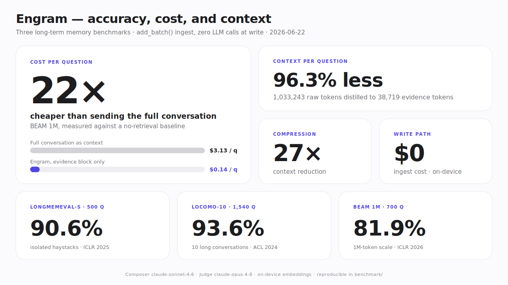

# Benchmarks

Engram ships three reproducible benchmark scripts covering progressively harder long-term memory tasks. The numbers below come from running them against real databases with publicly available datasets. All three use on-device embeddings (free, no API cost at ingest) and the same retrieval pipeline.

> [!WARNING]
> **Honest setup note**: all three benchmarks ingest memories via `add_batch()` — raw episodic turns stored verbatim, no LLM extraction at ingest time. This is a deliberate floor measurement of Engram's retrieval layer. `add_conversation()` (full LLM-based extraction, deduplication, and supersession) is expected to score higher on structured fact types like `knowledge-update` and `preference-following` but was not used here. The composer (`claude-sonnet-4-6`) and judge (`claude-opus-4-8`) are different models, but both from Anthropic. A stronger model grading a weaker one is stricter than self-judging, but it is still same-vendor; for full independence, re-judge with a non-Anthropic model using `--rejudge-only`.

---

## Results at a glance

*Latest run set: **2026-06-22** (`benchmark/runs/lme-final`, `locomo-final`, `beam-1m-final`).*


| Benchmark                     | Dataset                             | Questions | Accuracy  |
| ----------------------------- | ----------------------------------- | --------- | --------- |
| **LongMemEval-S** (ICLR 2025) | isolated per-question haystacks     | 500       | **90.6%** |
| **LoCoMo-10** (ACL 2024)      | 10 long-running conversations       | 1,540     | **93.6%** |
| **BEAM 1M** (ICLR 2026)       | 35 conversations, 10 question types | 700       | **81.9%** |




---

## LongMemEval-S — 90.6%

**Dataset**: 500 questions, each with its own isolated haystack of chat histories
**Composer**: `claude-sonnet-4-6` · **Judge**: `claude-opus-4-8`
**Embeddings**: `sentence-transformers/all-MiniLM-L6-v2` (384-d, on-device)
**Retrieval**: hybrid search + cross-encoder rerank, session-diversified (max 4 turns/session), 60 memories/question
**Graph depth**: 0 (disabled)


| Question type             | Accuracy  | Raw           |
| ------------------------- | --------- | ------------- |
| single-session-user       | 98.6%     | 69 / 70       |
| abstention                | 96.7%     | 29 / 30       |
| knowledge-update          | 96.2%     | 75 / 78       |
| single-session-assistant  | 94.6%     | 53 / 56       |
| single-session-preference | 93.3%     | 28 / 30       |
| temporal-reasoning        | 88.0%     | 117 / 133     |
| multi-session             | 83.5%     | 111 / 133     |
| **Overall**               | **90.6%** | **453 / 500** |


The 47 failures are almost entirely reader-side. A prompt-free retrieval check (`--score-retrieval`) surfaces the gold answer session for **469 / 470 answerable questions (99.8% hit-rate, 99.3% mean recall)**. Only one answerable question was a true retrieval miss; every other failure had its evidence sitting in the context block, so the composer is what missed, not the retriever.

---

## LoCoMo-10 — 93.6%

LoCoMo (ACL 2024) uses 10 long-running synthetic two-person conversations spanning hundreds of sessions each. We evaluate categories 1–4 (1,540 questions); category 5 (adversarial) is excluded per the benchmark spec.

**Dataset**: 1,540 questions across 10 conversations
**Composer**: `claude-sonnet-4-6` · **Judge**: `claude-opus-4-8`
**Embeddings**: `sentence-transformers/all-MiniLM-L6-v2` (384-d, on-device)
**Retrieval**: hybrid search + cross-encoder rerank + lineage traversal, session-diversified (max 6 turns/session), 100 memories/question
**Graph depth**: 0 (disabled — auto-ingest creates no graph edges, so traversal is a no-op)


| Category    | Accuracy  | Raw               |
| ----------- | --------- | ----------------- |
| single-hop  | 95.1%     | 800 / 841         |
| temporal    | 94.4%     | 303 / 321         |
| multi-hop   | 93.6%     | 264 / 282         |
| open-domain | 78.1%     | 75 / 96           |
| **Overall** | **93.6%** | **1,442 / 1,540** |


Open-domain (78.1%) is the honest weak spot. These questions ask about world knowledge that was never stored in the conversation, and no retrieval tuning fills a gap that was never in the corpus.

---

## BEAM 1M — 81.9%

BEAM (ICLR 2026) is the hardest of the three. It tests ten distinct question types, including some that require Engram to do things raw retrieval systems fundamentally cannot: identify contradictions between turns, infer chronological event order, and produce full-span conversation summaries. We ran the full 1M-token split: 35 conversations × 20 questions = 700 total.

**Dataset**: 700 questions across 35 conversations (1M token scale)
**Composer**: `claude-sonnet-4-6` · **Judge**: `claude-opus-4-8`
**Embeddings**: `sentence-transformers/all-MiniLM-L6-v2` (384-d, on-device)
**Retrieval**: hybrid search + cross-encoder rerank + lineage; candidate pool 500 pre-rerank, 100 post-rerank
**Scoring**: rubric nugget scoring per question (0 / 0.5 / 1.0 per nugget, mean ≥ 0.5 = pass)
**Graph depth**: 0 (disabled — auto-ingest creates no graph edges, so traversal is a no-op)


| Question type            | Accuracy  | Raw           |
| ------------------------ | --------- | ------------- |
| abstention               | 97.1%     | 68 / 70       |
| contradiction_resolution | 91.4%     | 64 / 70       |
| preference_following     | 90.0%     | 63 / 70       |
| multi_session_reasoning  | 88.6%     | 62 / 70       |
| instruction_following    | 87.1%     | 61 / 70       |
| event_ordering           | 84.3%     | 59 / 70       |
| information_extraction   | 81.4%     | 57 / 70       |
| knowledge_update         | 74.3%     | 52 / 70       |
| temporal_reasoning       | 65.7%     | 46 / 70       |
| summarization            | 58.6%     | 41 / 70       |
| **Overall**              | **81.9%** | **573 / 700** |


Overall average nugget score: **0.735** (rubric nuggets scored 0 / 0.5 / 1.0; mean ≥ 0.5 = pass)

### What the BEAM script does differently

The BEAM benchmark script applies several retrieval optimizations that are specific to its question types and worth being explicit about:

**Type-specific evidence budgets**: Single-fact question types (temporal_reasoning, information_extraction, knowledge_update, preference_following, abstention) are capped at 60 memories. All others use the full 100-memory budget. Giving single-fact types the full 100 increases noise without improving recall.

**Supplemental sub-queries for two hard types**:

- `event_ordering`: one targeted sub-query per rubric event, in addition to the broad query. Finds turns the general query misses because they describe a specific event, not the session topic.
- `contradiction_resolution`: five adversarial negation queries (`"never [topic]"`, `"not [topic]"`, etc.). The minority-opinion turn that creates a contradiction is semantically dominated by the majority-opinion turns and rarely appears in the top-500 reranked results. These queries surface it and are prepended to guarantee it falls within the evidence window.

**Question-type injection into the composer**: The question type is passed explicitly in the user prompt (`QUESTION TYPE: contradiction_resolution`) so type-specific rules in the composer system prompt fire reliably. Without this, the composer doesn't distinguish between "answer the question" and "report the contradiction without resolving it."

These are real engineering decisions that improve the relevant question types, but they're benchmark-tuned. A production agent doesn't know its question type in advance.

### Where BEAM still fails

**Summarization (58.6%)** is the weakest type and stays that way for an architectural reason, not a tuning one. The rubric checks for coverage across the entire conversation span, typically 6–8 distinct time periods and topic clusters. Relevance-ranked retrieval is precision-optimized: it returns the most similar turns, which cluster around the question topic and one or two recent sessions. Coverage-maximizing retrieval (representative samples from every session regardless of query similarity) doesn't exist in the current API surface. Corpus stratification lifted this well above its old floor, but it remains the type most exposed to retrieval that optimizes for relevance instead of breadth.

**Temporal reasoning (65.7%)** misses when BEAM embeds date information implicitly in turn text (`"[May 15, 2023] USER: ..."`). The recall operator resolves temporal phrases correctly, but when a question asks for date arithmetic (`"how many days between X and Y"`), Engram has to extract two dates from two separate turns and compute the interval in the composer pass. The temporal_chain recall intent (parallel search per event anchor, evidence merged chronologically) was built for this and helps, but the gap stays when dates appear only as inline text rather than structured metadata.

---

## Latency & context efficiency

Engram efficiency at a glance — BEAM 1M: 81.9% accuracy, 38,719 evidence tokens per query, 96.3% less than full context, 27× reduction

Per-question wall-clock and token economics from the **2026-06-22** runs. "Evidence tokens" is what the composer actually reads; "full context" is the size of the raw conversation(s) that evidence was distilled from. The gap between them is the compression Engram buys you: the composer never sees the haystack, only the reranked evidence block.


| Benchmark     | Ingest      | Retrieval | Generation | Total — p50 / avg / p95 |
| ------------- | ----------- | --------- | ---------- | ----------------------- |
| LongMemEval-S | 14.4 s      | 6.3 s     | 8.1 s      | 29.1 / 28.8 / 39.1 s    |
| LoCoMo-10     | amortized * | 2.9 s     | 11.6 s     | 13.5 / 14.6 / 22.0 s    |
| BEAM 1M       | amortized * | 3.5 s     | 23.7 s     | 19.6 / 27.2 / 75.9 s    |


* LongMemEval ingests a fresh haystack for every question, so its ingest (~14.4 s) is charged per question. LoCoMo and BEAM ingest each long conversation once and amortize it across all of that conversation's questions, so ingest is not part of the per-question total.


| Benchmark     | Evidence tokens | Full context | Compression | Search hits |
| ------------- | --------------- | ------------ | ----------- | ----------- |
| LongMemEval-S | 11,345          | 101,601      | 88.8%       | 58          |
| LoCoMo-10     | 4,608           | 17,888       | 74.2%       | 100         |
| BEAM 1M       | 38,719          | 1,033,243    | 96.3%       | 80          |


The BEAM row is the headline: Engram hands the composer **39K evidence tokens distilled from a 1.03M-token conversation, a 96.3% reduction**, and the composer answers from that block alone. At Anthropic list prices the composer costs about $0.14 per question on BEAM, versus a projected $3.13 per question if you fed the whole conversation in every time, roughly 22× cheaper. Generation dominates latency on BEAM (23.7 s of the 27.2 s average) because that evidence block is large and dense; retrieval itself is only 3.5 s.

---

## Cost savings

The composer only ever reads the reranked evidence block, never the full conversation. That is where the money is. The table below puts Engram's per-question composer cost next to the no-retrieval baseline: what it would cost to send the entire conversation as context for every question. Both use Anthropic list prices; dollar figures come from provider-billed token usage, and the compression baseline is counted with tiktoken (`o200k_base`).


| Benchmark     | Compression | Composer $/q | Full-context $/q | Cheaper by |
| ------------- | ----------- | ------------ | ---------------- | ---------- |
| LongMemEval-S | 88.8%       | $0.052       | $0.323           | 6.2×       |
| LoCoMo-10     | 74.2%       | $0.026       | $0.066           | 2.5×       |
| BEAM 1M       | 96.3%       | $0.141       | $3.13            | 22.1×      |


The savings track conversation length. On BEAM's 1M-token conversations the full-context baseline is brutal — $3.13 per question, composer alone — so retrieval pays off 22×. On LoCoMo's short conversations the whole history is already small, so retrieval only buys 2.5×. That is the honest shape of it: the longer your history, the more retrieval saves, and on a short chat it barely matters.

Two things the per-question composer cost leaves out, both in Engram's favor:

- **Ingest is free.** Embeddings run on-device (`all-MiniLM-L6-v2`), so there is no LLM bill at write time. The full-context baseline has no ingest step to compare against, but it re-reads the entire conversation on every single question, which is the cost the table captures.
- **The judge is excluded.** It runs only to score the benchmark, not in a real deployment. Counting it, the all-in cost per question was $0.068 (LongMemEval), $0.032 (LoCoMo), and $0.186 (BEAM).

Whole-run totals: $33.87 for LongMemEval (500 q), $49.04 for LoCoMo (1,540 q), and $129.88 for BEAM (700 q), composer plus judge.

---

## The shared pipeline

Shared benchmark pipeline — zero-LLM ingest, three fused retrieval surfaces, one composer pass, independent judge

All three benchmarks run the same core pipeline:

```
add_batch() → search() + recall() + get_lineage() → composer LLM
```

**Ingest** (`add_batch()`): raw conversation turns are embedded on-device and written to pgvector. No LLM is called at this stage. Ingestion takes roughly 14 seconds per question on LongMemEval.

**Retrieve** — three surfaces, all called per question:


| API                                  | What it does                                                                                                                                                                                                           |
| ------------------------------------ | ---------------------------------------------------------------------------------------------------------------------------------------------------------------------------------------------------------------------- |
| `search(mode='hybrid', rerank=True)` | pgvector cosine + PostgreSQL full-text, fused with Reciprocal Rank Fusion, then cross-encoder reranked against the question                                                                                            |
| `recall(compose_answer=False)`       | intent-classified retrieval (current / historical / event / lineage / temporal_chain); passes structured lineage evidence — current value, superseded predecessors, conflict notes — without generating a prose answer |
| `get_lineage()`                      | follows supersession chains so corrected values carry their history into the evidence block                                                                                                                            |


> [!NOTE]
> Engram also exposes `traverse_many()` for multi-hop graph traversal, but it is **not** exercised by these benchmarks: the `add_batch()` ingest path creates no graph edges, so traversal is a no-op. It is available for applications that populate their own relations via `add_relation()`.

**Generate**: one composer LLM call assembles the evidence block into an answer. The judge runs separately on the same output.

> [!NOTE]
> **What this measures**: All three benchmarks bypass `add_conversation()` (Engram's full LLM-extraction pipeline). The scores reflect the retrieval layer as a raw substrate — episodic turns stored verbatim, with all reasoning deferred to query time. `add_conversation()` adds semantic extraction, fact deduplication, and conflict resolution at ingest; these are expected to improve structured fact types. The benchmark numbers are a floor, not a ceiling.

---

## What each component contributes (LongMemEval ablation)


| Configuration          | Composer | Rerank | Accuracy  |
| ---------------------- | -------- | ------ | --------- |
| Hybrid search only     | Haiku    | no     | 77.8%     |
| + cross-encoder rerank | Haiku    | yes    | 87.0%     |
| + stronger composer    | Sonnet   | yes    | **90.6%** |


**Reranking is the biggest single lever.** The 9-point gap between no-rerank and rerank is retrieval quality: irrelevant turns are cut before the composer sees them. The additional 3 points from Haiku to Sonnet is reasoning quality over evidence that's already clean.

**Evidence budget interacts with question type.** Tightening below 60 memories regressed aggregation and multi-session questions. 60 memories over a reranked pool outperformed 30 memories with higher nominal precision, because counting and cross-session reasoning need every relevant turn in context.

### Retrieval vs. reader: how much is the prompt?

Two tools isolate where accuracy actually comes from, because end-to-end accuracy conflates retrieval, composer prompt, model, and judge:

- `--score-retrieval <traces.jsonl>` computes a **prompt-free retrieval hit-rate**: it joins the retrieved session ids against the dataset's gold `answer_session_ids`. No LLM, no judge. On the 90.6% run, retrieval surfaces the gold answer session **99.8%** of the time (469 / 470 answerable; per question type, all ≥96.7%). Retrieval is not the bottleneck on LongMemEval; wherever an answer is wrong, the evidence was almost always present.
- `--dumb-reader` swaps the tuned composer for a neutral one-paragraph reader, holding ingest, retrieval, and judge identical. The accuracy delta isolates the prompt's contribution.

On a 100-question Sonnet slice: the **dumb reader scores 86%**, the tuned composer **91%** — a directional +5 points (not statistically significant at this sample, McNemar p≈0.23), concentrated entirely in hard multi-session questions. The same tuned prompt was net-*negative* on Haiku. Read together: the substrate (retrieval + the model reading clean evidence) carries ~95% of the result; the 300-line composer prompt is a model-specific top-up, not the engine, and should not be treated as portable accuracy. A caveat on the retrieval number: hit-rate is measured at session granularity, so it is an upper bound on evidence adequacy (the answer-bearing *turn* within a retrieved session may still be trimmed by the budget).

---

## Where each benchmark still fails

**LongMemEval** (47 failures): all but one had the right session in the retrieved evidence, so these are composer errors, not retrieval (the prompt-free check scores retrieval at 99.8%, 469 / 470 answerable). Just one answerable question was a true retrieval miss.

**LoCoMo open-domain** (22% miss rate): world knowledge the system never ingested. Retrieval cannot fill facts that were never stored.

**BEAM summarization** (41% miss rate): relevance-ranked search returns similar turns, not representative turns. A question requiring coverage of 6–8 distinct time periods undercounts, because the highest-scoring memories cluster around the question topic and the most recent sessions. Corpus stratification narrows this but the gap is in the retrieval surface itself, not the prompt.

**BEAM temporal reasoning** (34% miss rate): two-hop date arithmetic. Both event dates are usually in the evidence block, but computing the interval requires the composer to extract two dates from different turns and subtract. Accuracy here depends heavily on how explicitly dates are stated in the conversation. When dates appear only as inline text (`[May 15, 2023]`), the composer handles it. When they're implicit (`"that was three weeks after I started"`), the chain breaks.

---

## Reproduce it

All scripts are in `benchmark/`. Data files go in `data/`.

> [!WARNING]
> LLM API calls for composer and judge are billable. On-device embeddings are free. Set `ENGRAM_ANTHROPIC_API_KEY` in your `.env`.

### LongMemEval — 90.6% run

```bash
python benchmark/longmemeval_benchmark.py \
  --llm-model claude-sonnet-4-6 \
  --judge-model claude-opus-4-8 \
  --rerank \
  --search-limit 60 \
  --max-per-session 4 \
  --local-embedding --embedding-model sentence-transformers/all-MiniLM-L6-v2 --embedding-dimension 384 \
  --concurrency 8 \
  --graph-depth 0 \
  --clean-db \
  --output-dir benchmark/runs/lme-final
```

### LongMemEval — cheaper run (Haiku composer, 87.0%)

```bash
python benchmark/longmemeval_benchmark.py \
  --rerank \
  --search-limit 60 \
  --max-per-session 4 \
  --judge-model claude-opus-4-8 \
  --local-embedding --embedding-model sentence-transformers/all-MiniLM-L6-v2 --embedding-dimension 384 \
  --concurrency 8 \
  --graph-depth 0 \
  --clean-db \
  --output-dir benchmark/runs/lme-cheap
```

### LoCoMo-10 — 93.6% run

```bash
python benchmark/locomo_benchmark.py \
  --conversations 0,1,2,3,4,5,6,7,8,9 \
  --search-limit 100 \
  --max-per-session 6 \
  --rerank \
  --concurrency 8 \
  --local-embedding --embedding-model sentence-transformers/all-MiniLM-L6-v2 --embedding-dimension 384 \
  --llm-model claude-sonnet-4-6 \
  --judge-model claude-opus-4-8 \
  --clean-db \
  --output-dir benchmark/runs/locomo-final
```

### BEAM 1M — 81.9% run

```bash
python benchmark/beam_benchmark.py \
  --chat-sizes 1M \
  --llm-model claude-sonnet-4-6 \
  --judge-model claude-opus-4-8 \
  --rerank \
  --search-limit 100 \
  --candidate-limit 500 \
  --cutoffs 100 \
  --event-ordering-tau \
  --answer-max-tokens 4000 \
  --local-embedding --embedding-model sentence-transformers/all-MiniLM-L6-v2 --embedding-dimension 384 \
  --concurrency 8 \
  --judge-concurrency 10 \
  --clean-db \
  --output-dir benchmark/runs/beam-1m-final
```

### Re-score without re-running

```bash
python benchmark/longmemeval_benchmark.py \
  --rejudge-only benchmark/runs/lme-final/traces.jsonl \
  --judge-model claude-sonnet-4-6 \
  --output-dir benchmark/runs/lme-rejudge
```

### Output files

Each run writes three files to the output directory:


| File              | Contents                                                                                                   |
| ----------------- | ---------------------------------------------------------------------------------------------------------- |
| `traces.jsonl`    | Question, gold answer, retrieved evidence, composer answer, retrieval stats — one JSON object per question |
| `judgments.jsonl` | Per-question verdict with reasoning                                                                        |
| `summary.json`    | Overall and per-type accuracy, full configuration                                                          |


---

## Notes for the community

**Judge stronger than composer**: all three headline runs use `claude-sonnet-4-6` as the composer and `claude-opus-4-8` as the judge. A stronger model grading a weaker one's output is stricter than self-judging, but composer and judge still share a vendor. For an independence check, re-judge with a non-Anthropic model via `--rejudge-only`.

**BEAM is a newer and harder benchmark**: unlike LongMemEval and LoCoMo, BEAM includes question types that test the retrieval system's ability to surface contradictions, reconstruct event orderings, and summarize across full conversation spans. The 81.9% headline includes a 58.6% summarization score that still drags the average down; the other nine question types average 84.4%.

`**add_batch()` vs `add_conversation()`**: these benchmarks deliberately use `add_batch()` (raw episodic turn storage, zero ingest LLM calls) to isolate the retrieval layer. Production use of `add_conversation()` performs LLM-based fact extraction, deduplication, and supersession at write time, which reduces retrieval noise for structured fact types. The benchmark scores are a lower bound on what the full Engram pipeline can achieve.

**Reproducibility**: given the same model versions and configuration, runs reproduce within ~1%. Accuracy changes meaningfully with embedding model choice, reranking, evidence budget, and composer strength — all exact parameters are stored in `summary.json` alongside the scores.
