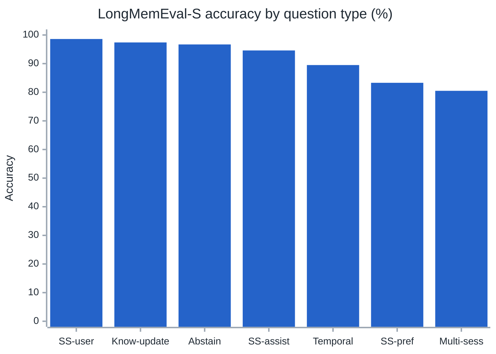

# Benchmarks

Engram is evaluated on **[LongMemEval](https://github.com/xiaowu0162/LongMemEval)** (ICLR 2025), the standard benchmark for long-term conversational memory. It tests whether a memory system can answer questions that require recalling, updating, aggregating, and temporally reasoning over information spread across hundreds of chat turns and many sessions.

> [!TIP]
> **Headline Result**: On **LongMemEval-S** (500 questions, ~115k turns), Engram scores **89.8%** — using entirely on-device embeddings, **zero LLM calls at ingestion**, and a cross-encoder reranker over hybrid search. Memories are written with `add_batch()`; all reasoning happens at read time via a single composer call.

---

## 1. Results

**Benchmark Parameters:**
- **Dataset**: LongMemEval-S, 500 questions
- **Composer and Judge**: `claude-sonnet-4-6`
- **Embeddings**: `all-MiniLM-L6-v2` (384-d, on-device)
- **Retrieval Engine**: Hybrid search (Vector + Full-Text) + Cross-Encoder Rerank
- **Evidence Budget**: 60 memories

| Question Type | Accuracy | Score |
|---------------|----------|-------|
| single-session-user | **98.6%** | 69 / 70 |
| knowledge-update | **97.4%** | 76 / 78 |
| abstention | **96.7%** | 29 / 30 |
| single-session-assistant | **94.6%** | 53 / 56 |
| temporal-reasoning | **89.5%** | 119 / 133 |
| single-session-preference | **83.3%** | 25 / 30 |
| multi-session | **80.5%** | 107 / 133 |
| **Overall** | **89.8%** | **449 / 500** |



---

## 2. Evaluation Methodology

Each question is fully isolated in its own memory namespace (using `agent_id` per question, which is purged before and after). The pipeline writes the haystack to memory, retrieves evidence with Engram's standard APIs, and then uses a single composer call to answer from that evidence. An independent LLM judge scores the output against the gold answer using the official LongMemEval rubric.

```mermaid
---
config:
  theme: base
  look: handDrawn
  themeVariables:
    primaryColor: '#e1f5fe'
    secondaryColor: '#fffde7'
    tertiaryColor: '#f3e5f5'
    fourthColor: '#ffebee'
---
flowchart LR
    %% Data Source
    H{{<b>Input Haystack</b><br/>~494 turns / question}}

    %% INGEST Stage
    subgraph INGEST ["🔵 1 · Ingest (engram.add_batch())"]
        direction TB
        I1(Render each turn<br/>→ episodic memory) --> 
        I2(Batch-embed<br/>on-device) --> 
        I3[(pgvector Insert)]
        
        %% Label note within subgraph
        Note1(<b>0 LLM calls</b>):::ingestNote
    end

    %% RETRIEVE Stage
    subgraph RETRIEVE ["🟡 2 · Retrieve (Engram APIs)"]
        direction TB
        S(["<b>engram.search()</b><br/>mode='hybrid', rerank=True"]) --> 
        D(Diversify across sessions<br/>→ 60-memory budget) --> 
        R(["<b>engram.recall()</b><br/>compose_answer=False"])
        
        %% Link internal details to Search
        Details1([pgvector + full-text]) -. fused .-> S
        Details2([RRF + cross-encoder]) -.-> S
    end

    %% GENERATE Stage
    subgraph GENERATE ["🟣 3 · Generate"]
        G([<b>Composer LLM</b><br/>Answers from evidence])
    end

    %% JUDGE Stage
    subgraph JUDGE ["🔴 4 · Judge"]
        J([<b>LLM Judge</b><br/>Official rubric])
    end
    
    %% Output
    Out((Score))

    %% MAIN FLOW CONNECTIONS
    H ==> I1
    I3 ==> RETRIEVE
    R ==> G
    G ==> J
    J ==> Out

    %% --- STYLING ---
    %% Subgraph colors
    style INGEST fill:#e1f5fe,stroke:#01579b,stroke-width:2px,rx:10,ry:10
    style RETRIEVE fill:#fffde7,stroke:#fbc02d,stroke-width:2px,rx:10,ry:10
    style GENERATE fill:#f3e5f5,stroke:#7b1fa2,stroke-width:2px,rx:10,ry:10
    style JUDGE fill:#ffebee,stroke:#d32f2f,stroke-width:2px,rx:10,ry:10

    %% Node Shapes and base styles
    classDef process fill:#fff,stroke:#333,stroke-width:1px,rx:8,ry:8;
    classDef api fill:#fff,stroke:#333,stroke-width:2px,rx:20,ry:20;
    classDef db fill:#fff,stroke:#333,stroke-width:1px,rx:2,ry:2;
    classDef source fill:#fff,stroke:#01579b,stroke-width:2px;

    class I1,I2,D process;
    class S,R,G,J api;
    class I3 db;
    class H source;

    %% Special styling for internal details
    classDef detail fill:#fff,stroke:#777,stroke-width:1px,stroke-dasharray: 5 5,font-size:11px;
    class Details1,Details2 detail;

    %% Special styling for emphasis note
    classDef ingestNote fill:#01579b,color:#fff,stroke:none,font-weight:bold,rx:15,ry:15;
    class Note1 ingestNote;

    %% Connection styling
    linkStyle default stroke:#555,stroke-width:1px;
    linkStyle 0,3,6,7,8 stroke:#01579b,stroke-width:3px;
    linkStyle 4,5 stroke:#777,stroke-width:1px,stroke-dasharray: 5 5;
```



### Stage Breakdown

| Stage | Engram API | Execution Details |
|---|---|---|
| **Ingest** | `add_batch()` | Batched on-device embedding → `pgvector` insert. **No LLM required**. ~12s per question, fully parallelized. |
| **Retrieve** | `search(rerank=True)`<br>`recall()` | `pgvector` cosine + PostgreSQL full-text search, fused with Reciprocal Rank Fusion, time-decay, and importance weighting. A cross-encoder reorders the candidate pool. |
| **Generate** | `llm.complete_full()` | A single composer LLM call writes the final answer directly from the assembled evidence block. |
| **Judge** | — | An independent LLM judge evaluates the result; it does not touch the Engram DB. |

> [!NOTE]
> **What this configuration measures**: This benchmark explicitly exercises Engram as a *retrieval substrate*. It deliberately ingests raw conversational turns via `add_batch()` rather than routing through the semantic extraction pipeline (`add_conversation()`). This means fact-extraction, supersession, and graph relations are purposefully bypassed here. The result is the baseline floor of what the retrieval layer alone delivers.

---

## 3. What Each Component Contributes

The system was tuned through controlled ablation studies. Each row below introduces one additional capability:

| Configuration | Composer | Judge | Rerank | Overall Score |
|---|---|---|---|---|
| Hybrid search only | Haiku | Haiku | ❌ | 77.8% |
| + cross-encoder rerank + tuned recall | Haiku | Sonnet | ✅ | 87.0% |
| + stronger composer model | Sonnet | Sonnet | ✅ | **89.8%** |

### Key Findings
1. **Reranking is the largest retrieval lever.** Applying a cross-encoder over the hybrid candidate pool cuts irrelevant turns out of the evidence block, providing massive gains on temporal and preference questions.
2. **Retrieval recall must stay wide.** Aggressively shrinking the evidence budget to favor precision *regressed* counting and assistant-recall questions, which require every relevant turn to be in context. A 60-memory budget over a reranked pool proved optimal.
3. **The composer model is the final ceiling.** With retrieval solved, the remaining errors were multi-step reasoning failures (e.g., counting completeness and temporal interval arithmetic). A stronger composer model (Sonnet) closed most of that gap.

---

## 4. Remaining Failures

Of the 51 missed questions, **46 had the answer-bearing session already in the retrieved evidence**. These are composer reasoning errors, not retrieval gaps. 

They cluster in two distinct patterns:
- **Aggregation Completeness (Multi-session counting)**: The items are all in context, but the LLM miscounts by one, or misses an item scattered in a completely unrelated conversation.
- **Multi-hop Temporal Reasoning**: Questions like *"what time did I go to bed the day before my appointment"* require chaining two independent lookups and an interval computation, which models struggle with in a single pass.

These errors represent the genuine reasoning ceiling of the composer model; Engram's retrieval engine is no longer the bottleneck.

---

## 5. How to Reproduce

The benchmark suite lives in the [`benchmark/`](https://github.com/ahammadnafiz/engram/tree/main/benchmark) directory. It reads `data/longmemeval/longmemeval_s_cleaned.json` and writes traces, judgments, and a summary payload into the designated output directory.

> [!WARNING]
> This run executes LLM calls for the composer and judge, which are billable. Embeddings run completely on-device and are free. Ensure `ENGRAM_ANTHROPIC_API_KEY` is configured in your `.env`.

### Best Configuration (89.8%)
```bash
python benchmark/longmemeval_benchmark.py \
  --llm-model claude-sonnet-4-6 \
  --judge-model claude-sonnet-4-6 \
  --rerank \
  --search-limit 60 \
  --max-per-session 4 \
  --local-embedding --embedding-model all-MiniLM-L6-v2 --embedding-dimension 384 \
  --concurrency 8 \
  --graph-depth 0 \
  --clean-db \
  --output-dir benchmark/runs/lme-final-v4
```

### Cheap Configuration (Haiku composer)
```bash
python benchmark/longmemeval_benchmark.py \
  --rerank \
  --search-limit 60 \
  --max-per-session 4 \
  --judge-model claude-sonnet-4-6 \
  --local-embedding --embedding-model all-MiniLM-L6-v2 --embedding-dimension 384 \
  --concurrency 8 \
  --graph-depth 0 \
  --clean-db \
  --output-dir benchmark/runs/lme-cheap
```

### Re-score an existing run
```bash
python benchmark/longmemeval_benchmark.py \
  --rejudge-only benchmark/runs/lme-final-v4/traces.jsonl \
  --judge-model claude-sonnet-4-6 \
  --output-dir benchmark/runs/lme-rejudge
```

### Artifacts
Inside your output directory, you will find:
- `traces.jsonl`: Contains the question, gold answer, retrieved evidence, composer answer, and retrieval stats.
- `judgments.jsonl`: The per-question verdict.
- `summary.json`: The overall + per-type accuracy and full configuration settings.

---

## 6. Evaluation Notes

- **Judge Independence**: The headline run uses the same model family for the composer and the judge. Because LLM-as-judge logic can be lenient toward outputs from its own family, the most conservative score comes from an independent judge (e.g., composer `claude-sonnet-4-6`, judge `claude-opus-4-8`), achieved via the re-score command.
- **Reproducibility**: Accuracy scales heavily with the embedding model, composer/judge models, and retrieval depth. All exact parameters are reported above so the community can replicate the results.
- **Cost Scaling**: Ingestion is free (on-device embeddings). Query-time cost scales entirely with the composer and judge. The "cheap" Haiku configuration trades roughly 3 points of accuracy for a massive cost reduction.
