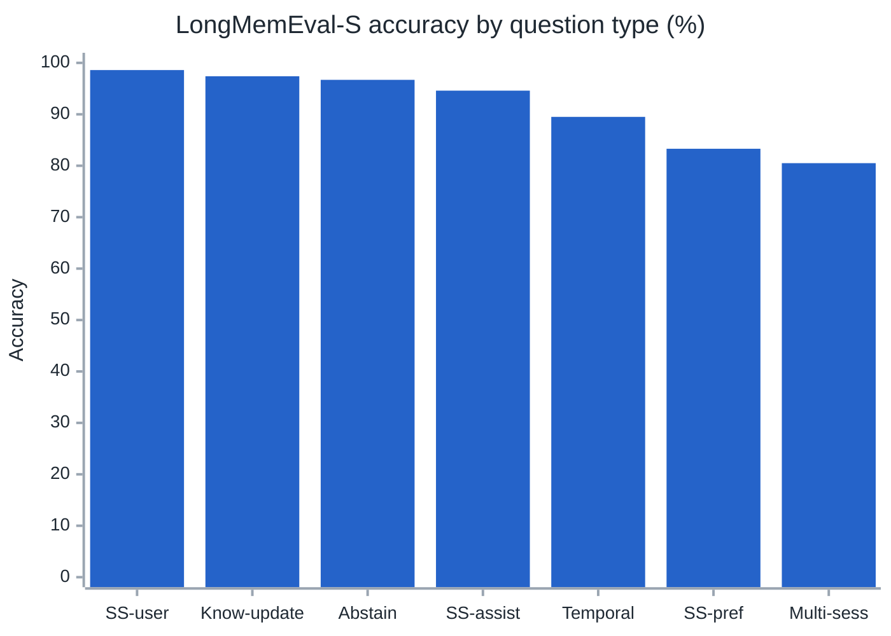
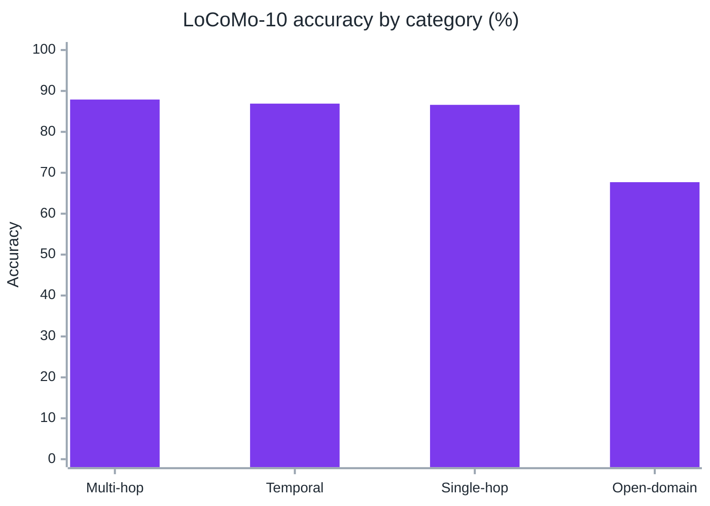

# Benchmarks

Engram ships two reproducible benchmark scripts. The numbers below come from running them against real databases with publicly available datasets.

We test on two standard long-term memory benchmarks: **LongMemEval** (ICLR 2025) and **LoCoMo** (ACL 2024). Both datasets were designed to break systems that rely on stuffing full chat history into a context window — they require recalling specific facts from hundreds of sessions, updating beliefs when information changes, and reasoning across time.

> [!TIP]
> **On LongMemEval-S** (500 questions, ~115k turns): **89.8%** overall. On **LoCoMo-10** (1,540 questions across 10 long conversations): **85.7%**. Both runs use on-device embeddings with no LLM calls at ingestion. All reasoning happens at query time.

---

## Results

### LongMemEval-S

**Dataset**: 500 questions, long-term chat histories averaging ~115k turns  
**Composer & Judge**: `claude-sonnet-4-6`  
**Embeddings**: `all-MiniLM-L6-v2` (384-d, on-device, free)  
**Retrieval**: hybrid search (vector + full-text) + cross-encoder rerank  
**Evidence budget**: 60 memories per question

| Question type | Accuracy | Raw |
|---|---|---|
| single-session-user | 98.6% | 69 / 70 |
| knowledge-update | 97.4% | 76 / 78 |
| abstention | 96.7% | 29 / 30 |
| single-session-assistant | 94.6% | 53 / 56 |
| temporal-reasoning | 89.5% | 119 / 133 |
| single-session-preference | 83.3% | 25 / 30 |
| multi-session | 80.5% | 107 / 133 |
| **Overall** | **89.8%** | **449 / 500** |



---

### LoCoMo-10

LoCoMo (ACL 2024) uses 10 long-running synthetic conversations spanning hundreds of sessions each. Questions cover single-hop fact recall, multi-hop reasoning, temporal ordering, and open-domain retrieval. We evaluate categories 1–4 (1,540 questions); category 5 is excluded per the benchmark spec.

**Dataset**: 1,540 questions across 10 conversations  
**Composer & Judge**: `claude-sonnet-4-6`  
**Embeddings**: `all-MiniLM-L6-v2` (384-d, on-device)  
**Retrieval**: hybrid search + cross-encoder rerank + lineage traversal  
**Evidence budget**: 60 memories, max 4 per session

| Category | Accuracy | Raw |
|---|---|---|
| multi-hop | 87.9% | 248 / 282 |
| temporal | 86.9% | 279 / 321 |
| single-hop | 86.6% | 728 / 841 |
| open-domain | 67.7% | 65 / 96 |
| **Overall** | **85.7%** | **1,320 / 1,540** |



The open-domain category is the weakest. These questions require world knowledge the memory system doesn't store — there's no retrieval fix for a fact that was never ingested.

---

## The pipeline

Both benchmarks run the same three-stage pipeline:

```
add_batch() → search() + recall() + get_lineage() + traverse_many() → composer LLM
```



```mermaid
---
config:
  theme: base
  look: handDrawn
  themeVariables:
    primaryColor: '#e1f5fe'
    secondaryColor: '#fffde7'
    tertiaryColor: '#f3e5f5'
    fourthColor: '#ffebee'
---
flowchart LR
    %% Data Source
    H{{<b>Input Haystack</b><br/>~494 turns / question}}

    %% INGEST Stage
    subgraph INGEST ["🔵 1 · Ingest (engram.add_batch())"]
        direction TB
        I1(Render each turn<br/>→ episodic memory) --> 
        I2(Batch-embed<br/>on-device) --> 
        I3[(pgvector Insert)]
        
        %% Label note within subgraph
        Note1(<b>0 LLM calls</b>):::ingestNote
    end

    %% RETRIEVE Stage
    subgraph RETRIEVE ["🟡 2 · Retrieve (Engram APIs)"]
        direction TB
        S(["<b>engram.search()</b><br/>mode='hybrid', rerank=True"]) --> 
        D(Diversify across sessions<br/>→ 60-memory budget) --> 
        R(["<b>engram.recall()</b><br/>compose_answer=False"])
        
        %% Link internal details to Search
        Details1([pgvector + full-text]) -. fused .-> S
        Details2([RRF + cross-encoder]) -.-> S
    end

    %% GENERATE Stage
    subgraph GENERATE ["🟣 3 · Generate"]
        G([<b>Composer LLM</b><br/>Answers from evidence])
    end

    %% JUDGE Stage
    subgraph JUDGE ["🔴 4 · Judge"]
        J([<b>LLM Judge</b><br/>Official rubric])
    end
    
    %% Output
    Out((Score))

    %% MAIN FLOW CONNECTIONS
    H ==> I1
    I3 ==> RETRIEVE
    R ==> G
    G ==> J
    J ==> Out

    %% --- STYLING ---
    %% Subgraph colors
    style INGEST fill:#e1f5fe,stroke:#01579b,stroke-width:2px,rx:10,ry:10
    style RETRIEVE fill:#fffde7,stroke:#fbc02d,stroke-width:2px,rx:10,ry:10
    style GENERATE fill:#f3e5f5,stroke:#7b1fa2,stroke-width:2px,rx:10,ry:10
    style JUDGE fill:#ffebee,stroke:#d32f2f,stroke-width:2px,rx:10,ry:10

    %% Node Shapes and base styles
    classDef process fill:#fff,stroke:#333,stroke-width:1px,rx:8,ry:8;
    classDef api fill:#fff,stroke:#333,stroke-width:2px,rx:20,ry:20;
    classDef db fill:#fff,stroke:#333,stroke-width:1px,rx:2,ry:2;
    classDef source fill:#fff,stroke:#01579b,stroke-width:2px;

    class I1,I2,D process;
    class S,R,G,J api;
    class I3 db;
    class H source;

    %% Special styling for internal details
    classDef detail fill:#fff,stroke:#777,stroke-width:1px,stroke-dasharray: 5 5,font-size:11px;
    class Details1,Details2 detail;

    %% Special styling for emphasis note
    classDef ingestNote fill:#01579b,color:#fff,stroke:none,font-weight:bold,rx:15,ry:15;
    class Note1 ingestNote;

    %% Connection styling
    linkStyle default stroke:#555,stroke-width:1px;
    linkStyle 0,3,6,7,8 stroke:#01579b,stroke-width:3px;
    linkStyle 4,5 stroke:#777,stroke-width:1px,stroke-dasharray: 5 5;
```

**Ingest** (`add_batch()`): raw conversation turns are embedded on-device and written to pgvector. No LLM is called. This takes roughly 12 seconds per question in the LongMemEval runs.

**Retrieve**: four surfaces run in parallel:

| API | What it does |
|---|---|
| `search(mode='hybrid', rerank=True)` | pgvector cosine + PostgreSQL full-text, fused with Reciprocal Rank Fusion, time-decay, and importance weighting; a cross-encoder re-orders the candidate pool |
| `recall(compose_answer=False)` | intent-classified retrieval with explicit date anchoring for temporal questions |
| `get_lineage()` | follows supersession chains to surface updated values when preferences or facts change |
| `traverse_many()` | multi-hop graph traversal for entity relationships |

**Generate**: a single composer LLM call answers from the assembled evidence block. The judge runs independently.

> [!NOTE]
> **What this measures**: Both benchmarks use `add_batch()` rather than `add_conversation()`. That deliberately bypasses semantic extraction, fact deduplication, and conflict resolution. The scores reflect the retrieval layer used as a raw substrate — a floor measurement, before Engram has done any structural work on the memories. `add_conversation()` users typically get cleaner, more structured memories, which should only improve these numbers.

---

## What each component adds

| Configuration | Composer | Judge | Rerank | LongMemEval |
|---|---|---|---|---|
| Hybrid search only | Haiku | Haiku | no | 77.8% |
| + cross-encoder rerank | Haiku | Sonnet | yes | 87.0% |
| + stronger composer | Sonnet | Sonnet | yes | **89.8%** |

**Reranking is the biggest single lever.** The cross-encoder cuts irrelevant turns before the composer sees them. That gap — 77.8% to 87.0% — is retrieval quality, not model quality.

**Widening the evidence budget helped more than tightening it.** Cutting aggressively to improve precision regressed counting and multi-session questions, which need every relevant turn in context. 60 memories over a reranked pool beat 30 over a precise one.

**The composer model is the ceiling once retrieval works.** After reranking, the remaining errors are multi-step reasoning failures. A stronger composer (Sonnet) closed most of that gap.

---

## Where it still fails

51 questions missed on LongMemEval. 46 of those had the right session already in the retrieved evidence — these are composer errors, not retrieval gaps.

The two failure modes that remain:

**Aggregation completeness**: All items are in context, but the LLM miscounts by one, or misses an item scattered across an unrelated conversation thread. "What have I bought this year?" fails when purchases span sessions that don't look topically related.

**Multi-hop temporal arithmetic**: Chaining two independent lookups into an interval computation in a single pass. Questions like *"what time did I go to bed the day before my appointment"* require two retrieval steps and subtraction. Models land one step and drop the other.

On LoCoMo, the 67.7% open-domain score brings the overall down. That category mixes in questions about world facts and context that was never stored — no retrieval optimization helps there.

---

## Reproduce it

All scripts are in `benchmark/`. Data files go in `data/`.

> [!WARNING]
> LLM API calls for the composer and judge are billable. On-device embeddings are free. Set `ENGRAM_ANTHROPIC_API_KEY` in your `.env`.

### LongMemEval — 89.8% run

```bash
python benchmark/longmemeval_benchmark.py \
  --llm-model claude-sonnet-4-6 \
  --judge-model claude-sonnet-4-6 \
  --rerank \
  --search-limit 60 \
  --max-per-session 4 \
  --local-embedding --embedding-model all-MiniLM-L6-v2 --embedding-dimension 384 \
  --concurrency 8 \
  --graph-depth 0 \
  --clean-db \
  --output-dir benchmark/runs/lme-final-v4
```

### LongMemEval — cheaper run (Haiku composer, 87.0%)

```bash
python benchmark/longmemeval_benchmark.py \
  --rerank \
  --search-limit 60 \
  --max-per-session 4 \
  --judge-model claude-sonnet-4-6 \
  --local-embedding --embedding-model all-MiniLM-L6-v2 --embedding-dimension 384 \
  --concurrency 8 \
  --graph-depth 0 \
  --clean-db \
  --output-dir benchmark/runs/lme-cheap
```

### LoCoMo-10 — 85.7% run

```bash
python benchmark/locomo_benchmark.py \
  --conversations 0,1,2,3,4,5,6,7,8,9 \
  --search-limit 60 \
  --rerank \
  --concurrency 8 \
  --llm-model claude-sonnet-4-6 \
  --judge-model claude-sonnet-4-6 \
  --clean-db \
  --output-dir benchmark/runs/locomo-sonnet
```

### Re-score without re-running

```bash
python benchmark/longmemeval_benchmark.py \
  --rejudge-only benchmark/runs/lme-final-v4/traces.jsonl \
  --judge-model claude-sonnet-4-6 \
  --output-dir benchmark/runs/lme-rejudge
```

### Output files

Each run writes three files to the output directory:

| File | Contents |
|---|---|
| `traces.jsonl` | Question, gold answer, retrieved evidence, composer answer, and retrieval stats — one JSON object per question |
| `judgments.jsonl` | Per-question verdict with reasoning |
| `summary.json` | Overall and per-type accuracy, full configuration parameters |

---

## Notes for the community

**Judge bias**: The headline LongMemEval run uses the same model family for both composer and judge. Same-family judges are known to be lenient. For a stricter number, run `--rejudge-only` with a different judge family (e.g., composer `claude-sonnet-4-6`, judge `claude-opus-4-8`).

**Reproducibility**: Given the same model versions and configuration, the runs reproduce. Accuracy changes meaningfully with the embedding model, search depth, and composer quality — all exact parameters are stored in `summary.json` alongside the scores, so you can see exactly what produced a given number.

**Cost tradeoff**: Ingestion costs nothing (on-device embeddings). Query-time cost scales entirely with composer and judge. Haiku gives up roughly 3 points on LongMemEval for a significant cost reduction — a reasonable tradeoff for long-running agents where every query doesn't need Sonnet-level composition.

**Extending the benchmark**: The scripts accept custom output directories and support `--conversations` subsets on LoCoMo for faster iteration. If you run different configurations, the `traces.jsonl` output is structured for easy analysis.
