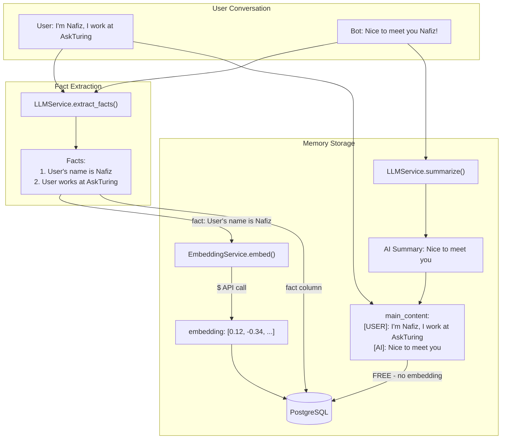
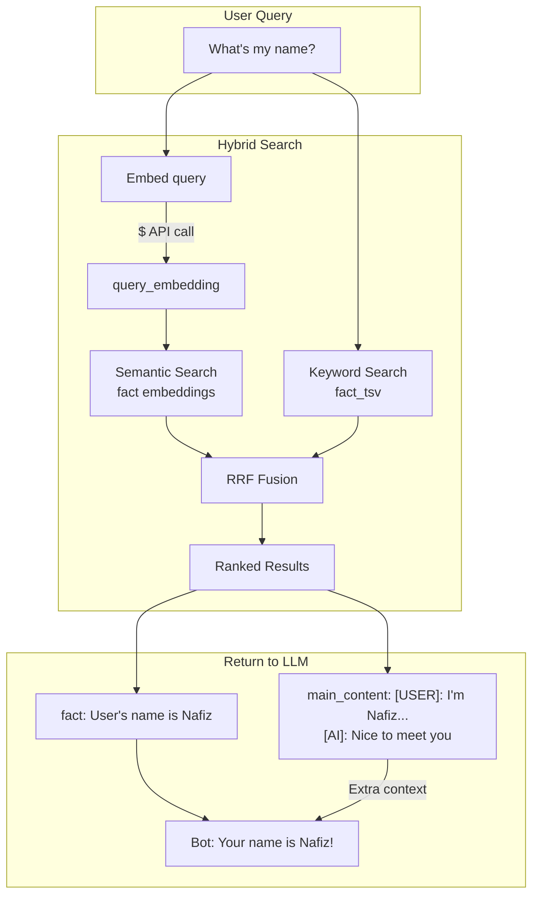
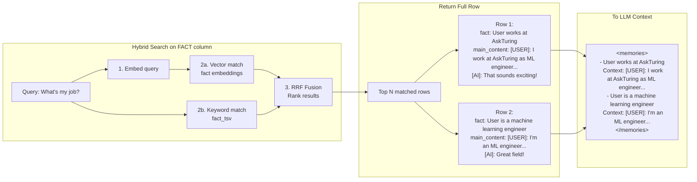

# Cleaned Mermaid Diagrams (Duplicates Removed)

## 1. Memory Storage Flow

```mermaid
flowchart TD
    subgraph Input [User Conversation]
        UserMsg["User: I'm Nafiz, I work at AskTuring"]
        BotMsg["Bot: Nice to meet you Nafiz!"]
    end
    
    subgraph Extraction [Fact Extraction]
        LLM["LLMService.extract_facts()"]
        Facts["Facts:<br/>1. User's name is Nafiz<br/>2. User works at AskTuring"]
    end
    
    subgraph Storage [Memory Storage]
        Summary["LLMService.summarize()"]
        AISummary["AI Summary: Nice to meet you"]
        
        MainContent["main_content:<br/>[USER]: I'm Nafiz, I work at AskTuring<br/>[AI]: Nice to meet you"]
        
        Embed["EmbeddingService.embed()"]
        Vector["embedding: [0.12, -0.34, ...]"]
        
        DB[(PostgreSQL)]
    end
    
    UserMsg --> LLM
    BotMsg --> LLM
    LLM --> Facts
    
    Facts -->|"fact: User's name is Nafiz"| Embed
    Embed -->|"$ API call"| Vector
    
    BotMsg --> Summary
    Summary --> AISummary
    UserMsg --> MainContent
    AISummary --> MainContent
    
    Vector --> DB
    MainContent -->|"FREE - no embedding"| DB
    Facts -->|"fact column"| DB
```

## 2. Memory Retrieval Flow (Hybrid Search)

```mermaid
flowchart TD
    subgraph Query [User Query]
        Q["What's my name?"]
    end
    
    subgraph HybridSearch [Hybrid Search]
        QEmbed["Embed query"]
        QVector["query_embedding"]
        
        Semantic["Semantic Search<br/>fact embeddings"]
        Keyword["Keyword Search<br/>fact_tsv"]
        
        RRF["RRF Fusion"]
        Results["Ranked Results"]
    end
    
    subgraph Return [Return to LLM]
        Fact["fact: User's name is Nafiz"]
        Context["main_content: [USER]: I'm Nafiz...<br/>[AI]: Nice to meet you"]
        Response["Bot: Your name is Nafiz!"]
    end
    
    Q --> QEmbed
    QEmbed -->|"$ API call"| QVector
    
    QVector --> Semantic
    Q --> Keyword
    
    Semantic --> RRF
    Keyword --> RRF
    
    RRF --> Results
    Results --> Fact
    Results --> Context
    
    Fact --> Response
    Context -->|"Extra context"| Response
```

## 3. Full Search and Context Flow

```mermaid
flowchart LR
    subgraph Search [Hybrid Search on FACT column]
        Query["Query: What's my job?"]
        
        EmbedQ["1. Embed query"]
        SemanticMatch["2a. Vector match<br/>fact embeddings"]
        KeywordMatch["2b. Keyword match<br/>fact_tsv"]
        
        RRF["3. RRF Fusion<br/>Rank results"]
    end
    
    subgraph Results [Return Full Row]
        TopFacts["Top N matched rows"]
        
        Row1["Row 1:<br/>fact: User works at AskTuring<br/>main_content: [USER]: I work at AskTuring as ML engineer...<br/>[AI]: That sounds exciting!"]
        
        Row2["Row 2:<br/>fact: User is a machine learning engineer<br/>main_content: [USER]: I'm an ML engineer...<br/>[AI]: Great field!"]
    end
    
    subgraph Context [To LLM Context]
        Memories["&lt;memories&gt;<br/>- User works at AskTuring<br/>  Context: [USER]: I work at AskTuring as ML engineer...<br/>- User is a machine learning engineer<br/>  Context: [USER]: I'm an ML engineer...<br/>&lt;/memories&gt;"]
    end
    
    Query --> EmbedQ
    EmbedQ --> SemanticMatch
    Query --> KeywordMatch
    SemanticMatch --> RRF
    KeywordMatch --> RRF
    RRF --> TopFacts
    TopFacts --> Row1
    TopFacts --> Row2
    Row1 --> Memories
    Row2 --> Memories
```