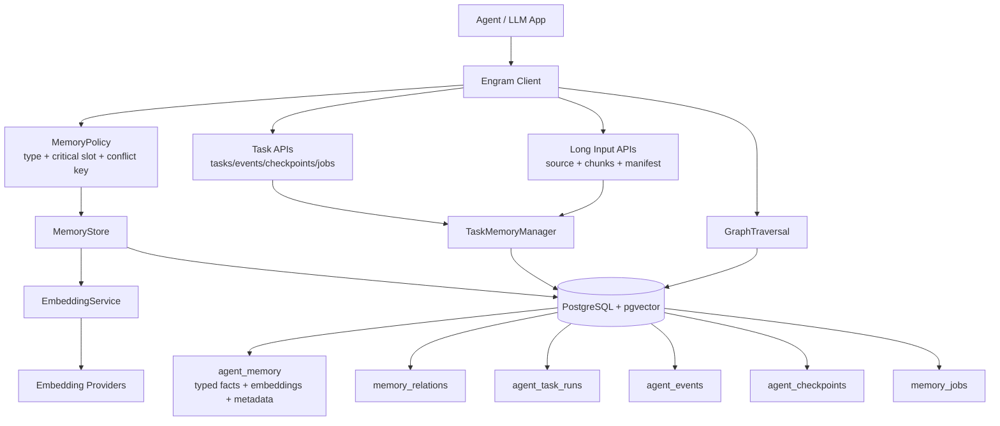
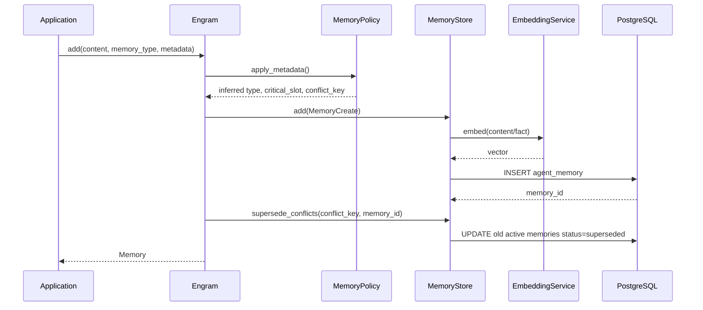
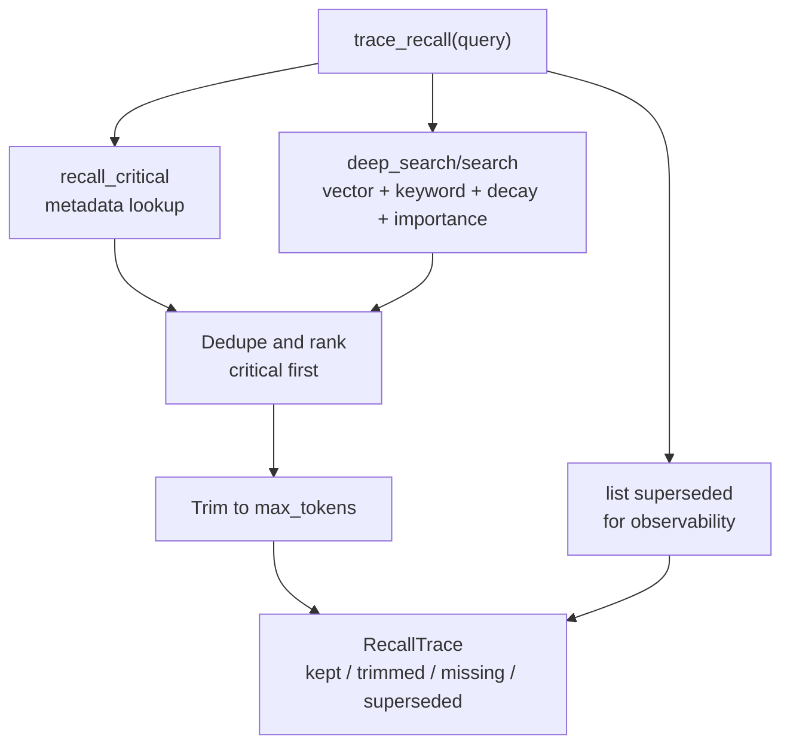
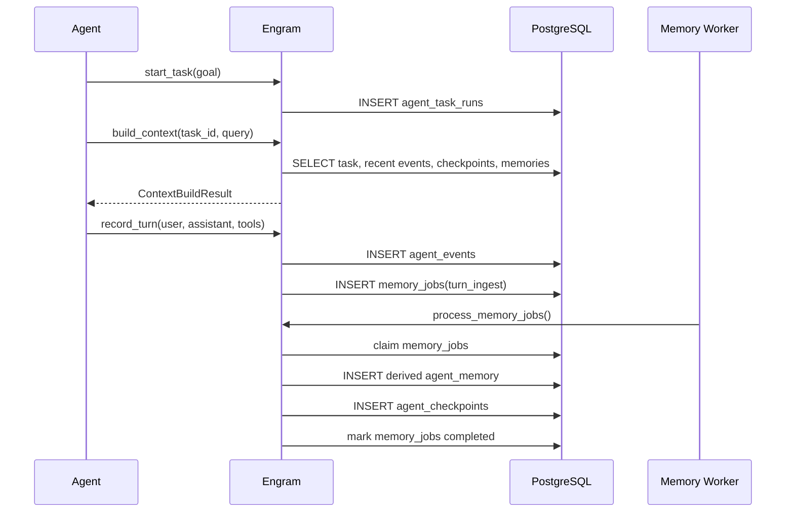
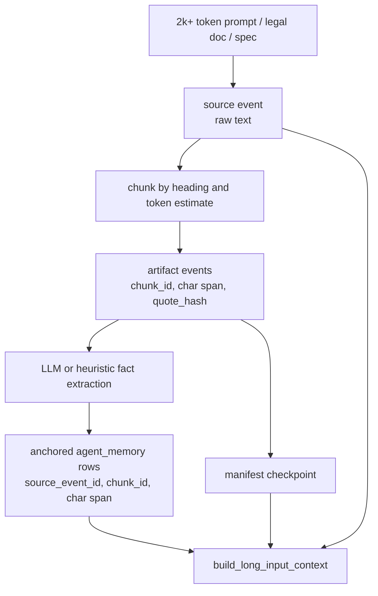
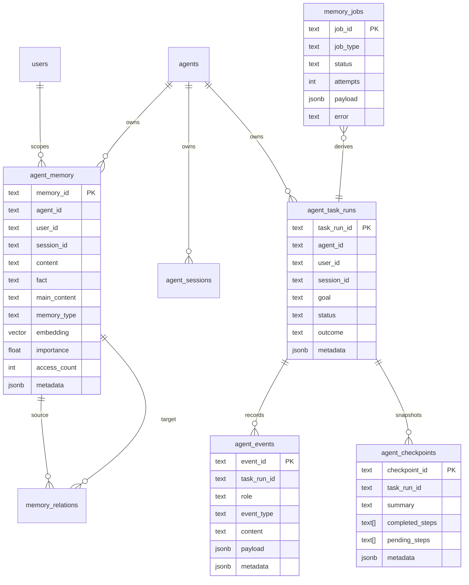
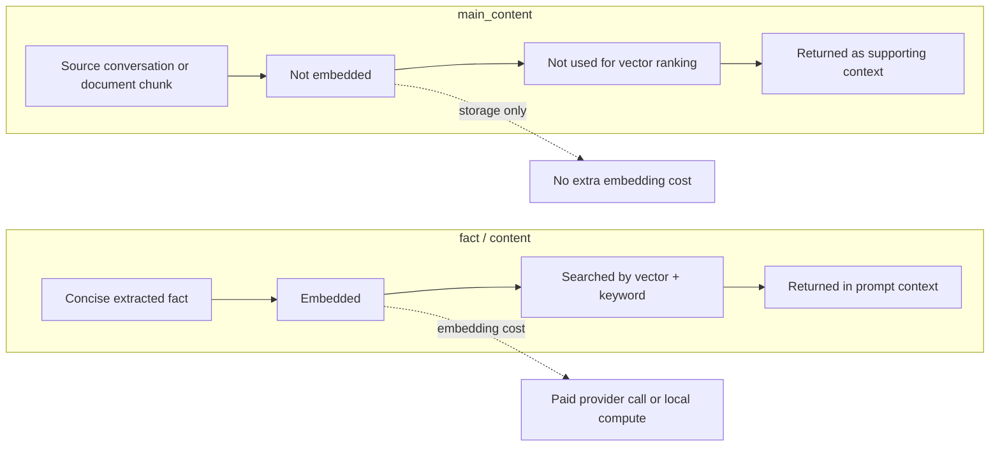

# Architecture Diagrams

## Two-Plane Memory Architecture

## Memory Write With Policy

## Trace Recall

## Long-Running Task Flow

## Long Input

## Database Entity View

## Two-Column Cost Model

