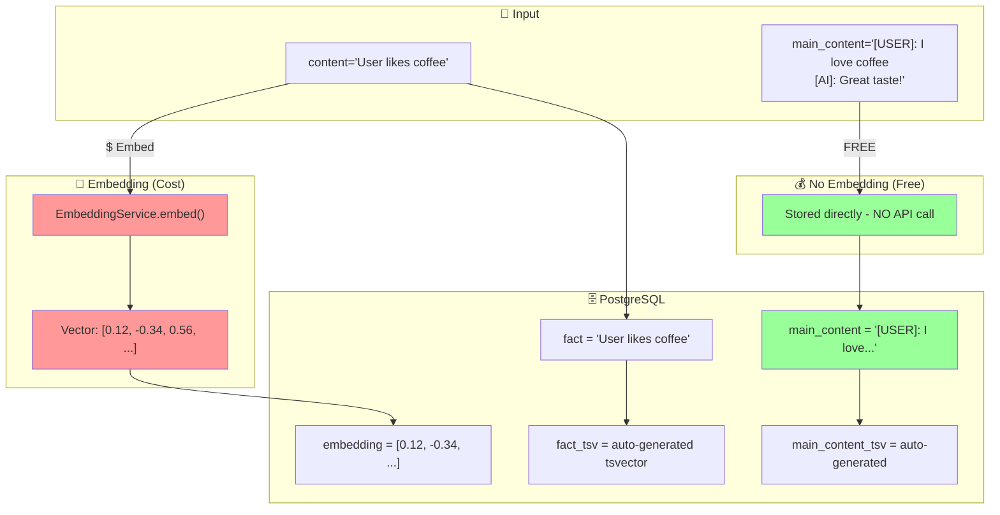
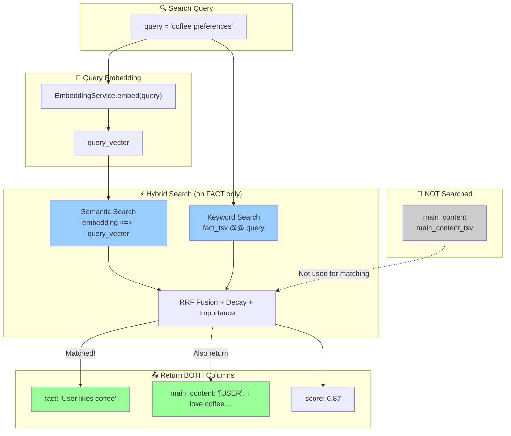
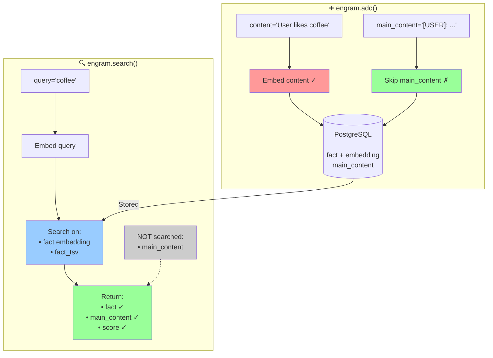
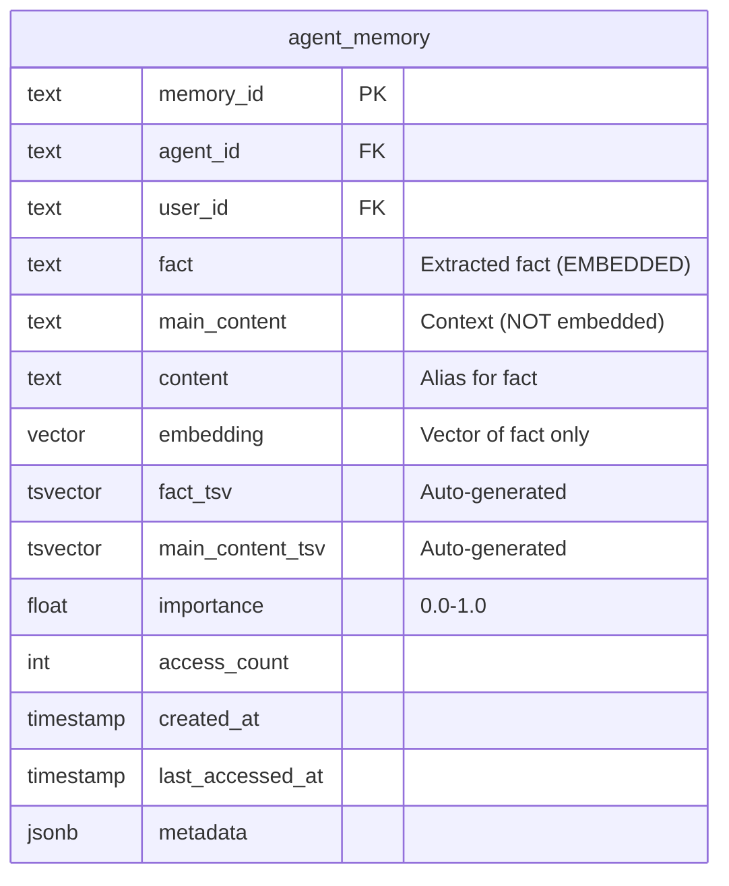
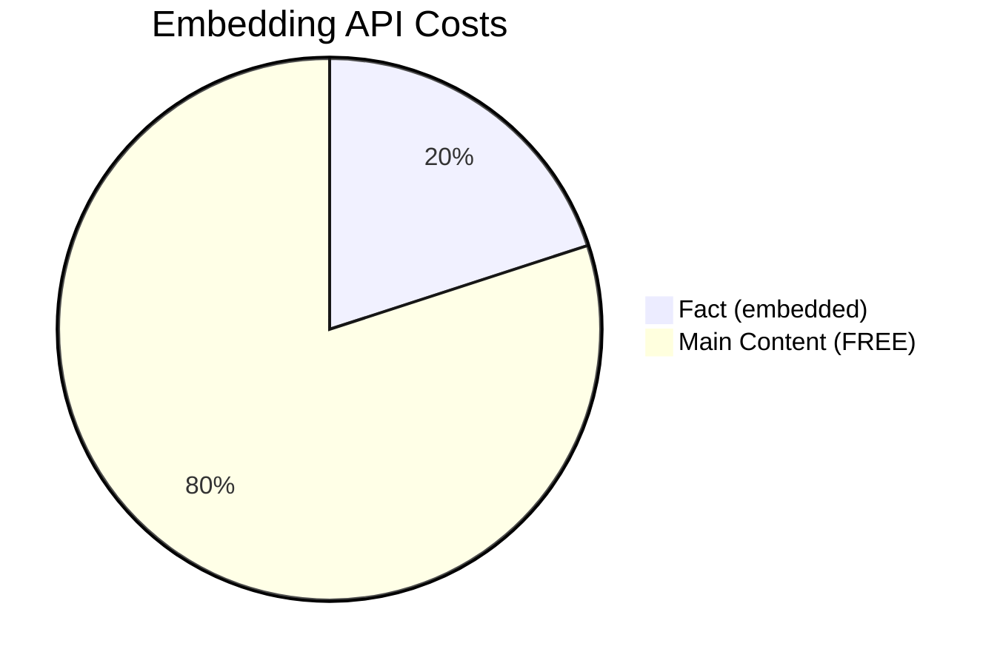
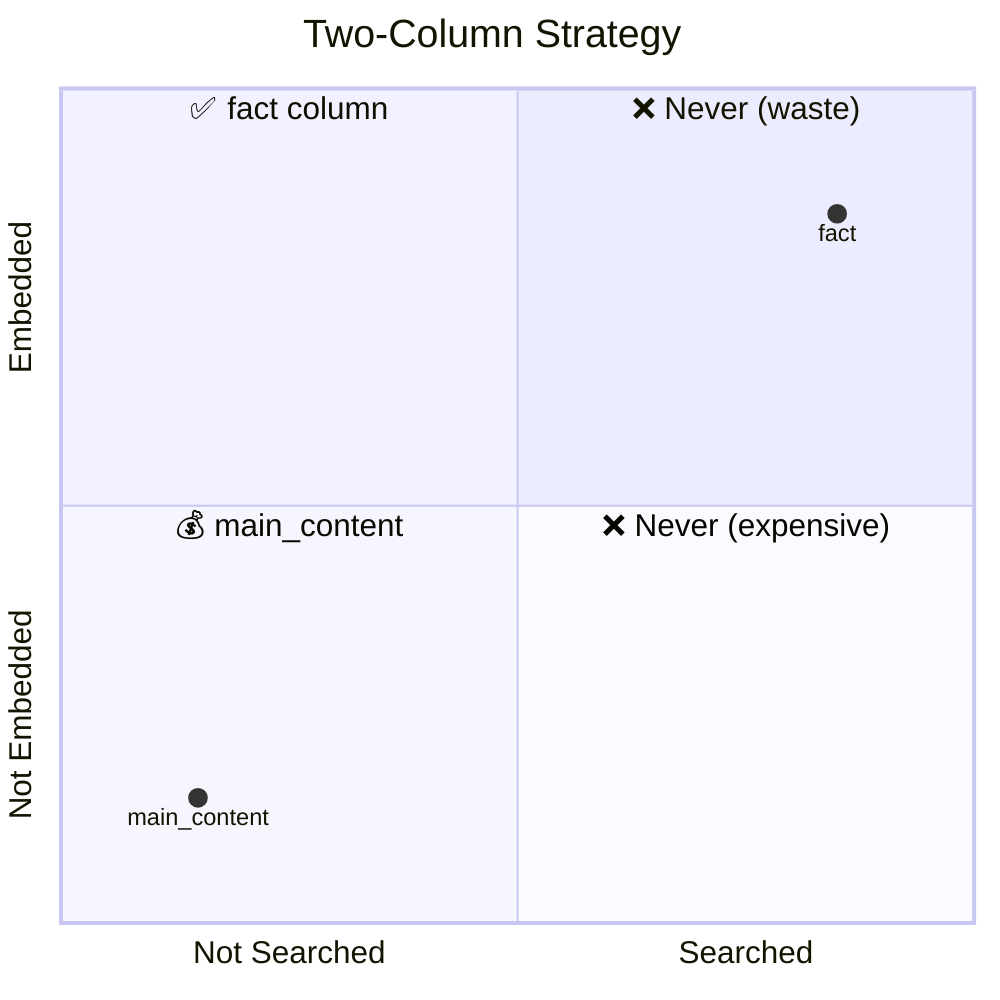
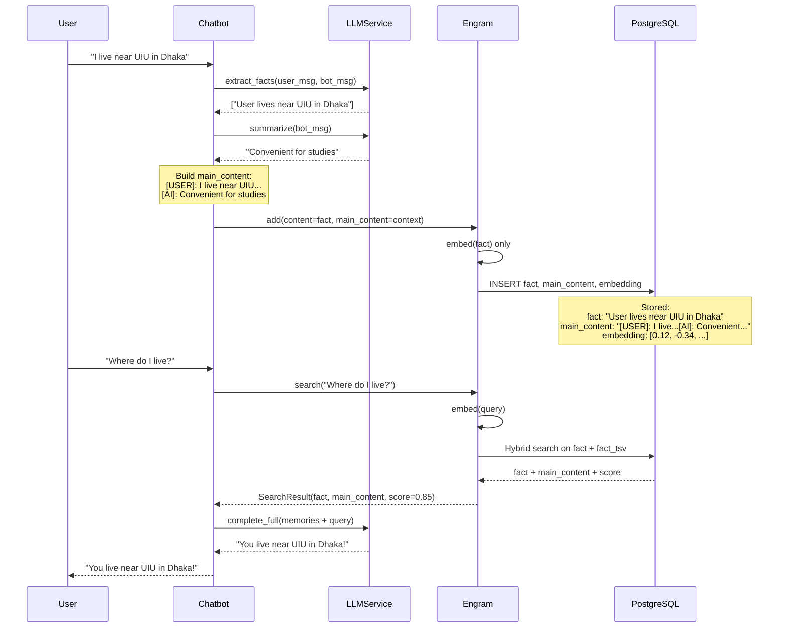

# Engram Two-Column Memory System Diagrams

## 1. ADD Flow - How Memory is Stored

## 2. SEARCH Flow - How Memory is Retrieved

## 3. Complete Two-Column System

## 4. Database Schema

## 5. Cost Comparison

## 6. Search vs Storage

## 7. Chatbot Memory Flow

## Summary Table

| Column | Stored | Embedded | Searched | Returned | Cost |
|--------|--------|----------|----------|----------|------|
| `fact` | ✅ | ✅ | ✅ | ✅ | $ |
| `main_content` | ✅ | ❌ | ❌ | ✅ | Free |
| `embedding` | ✅ | - | ✅ | ❌ | - |
| `fact_tsv` | ✅ | - | ✅ | ❌ | - |
