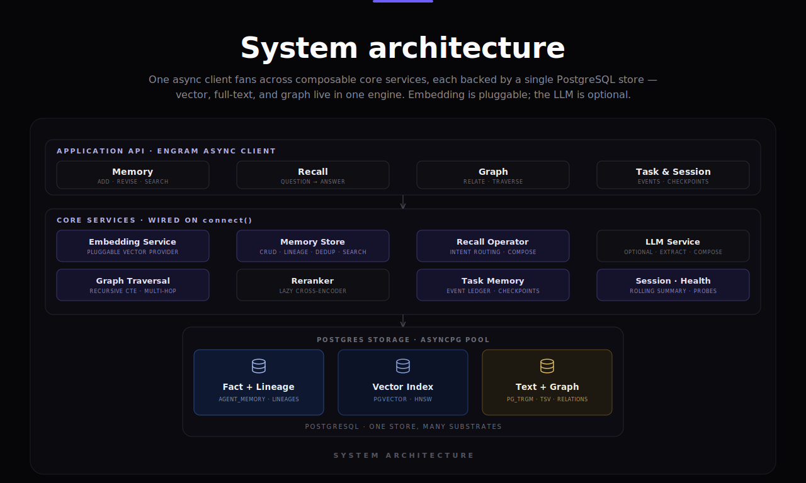
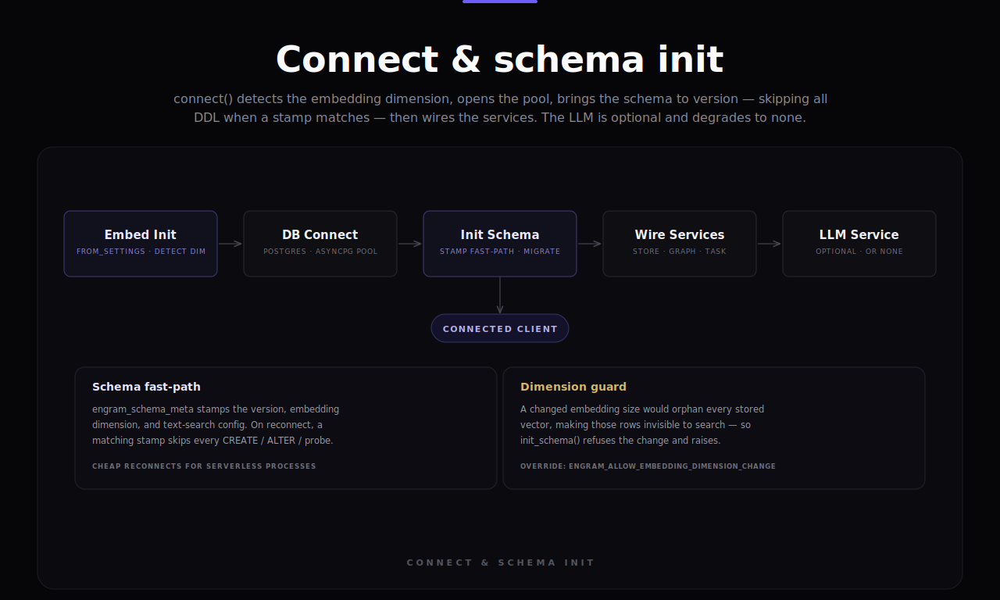
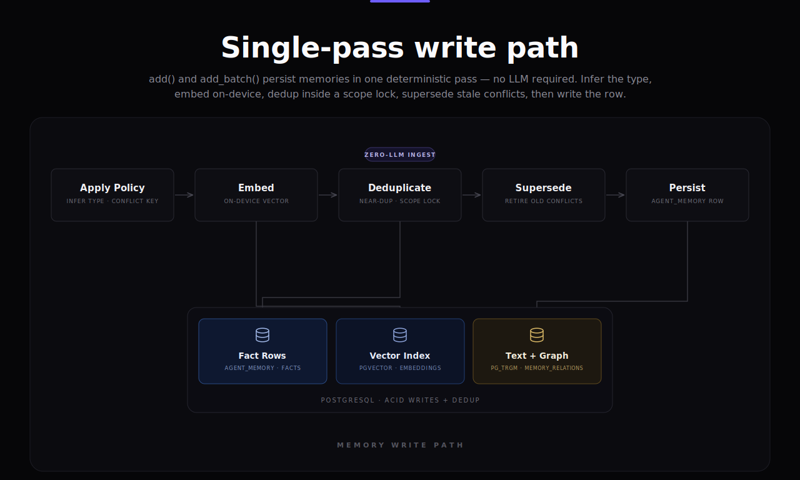
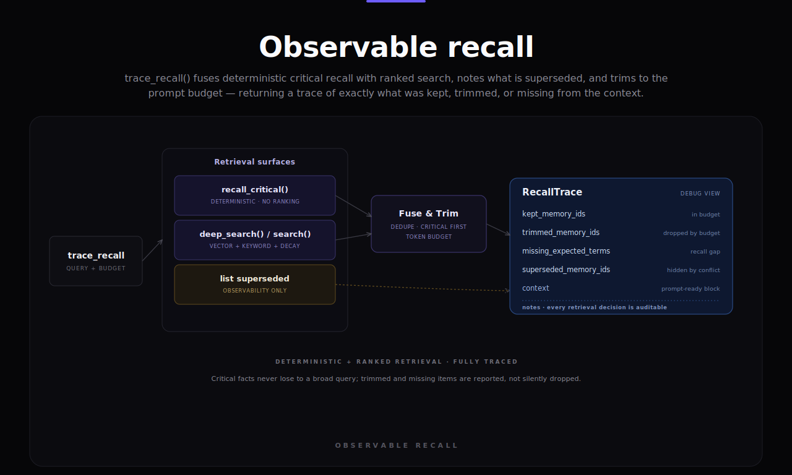
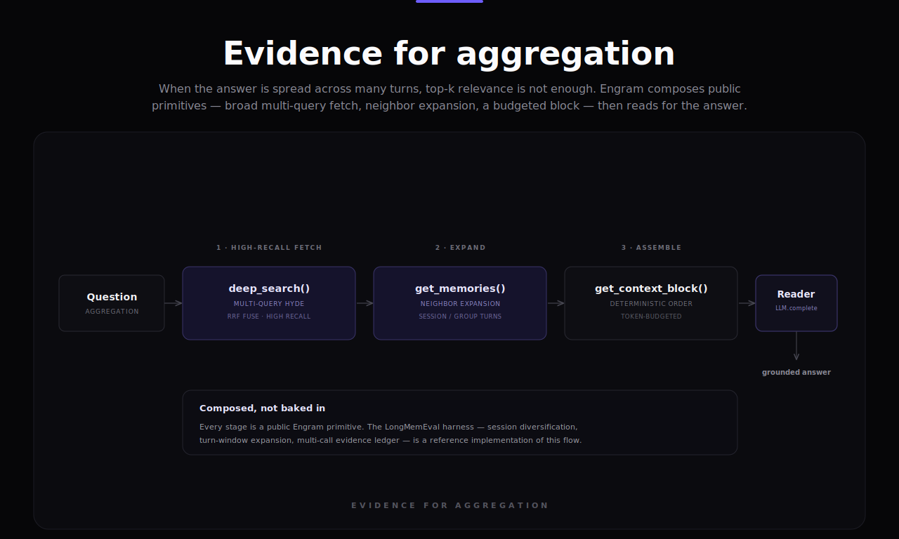
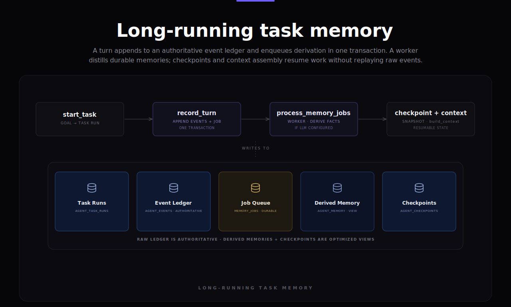
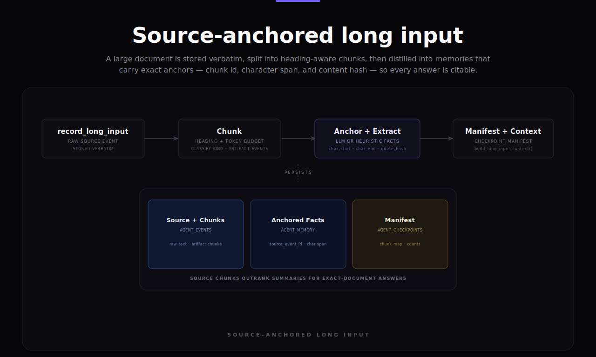
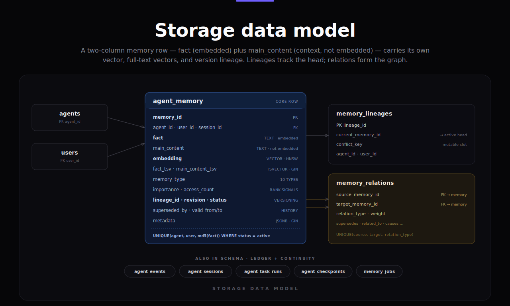
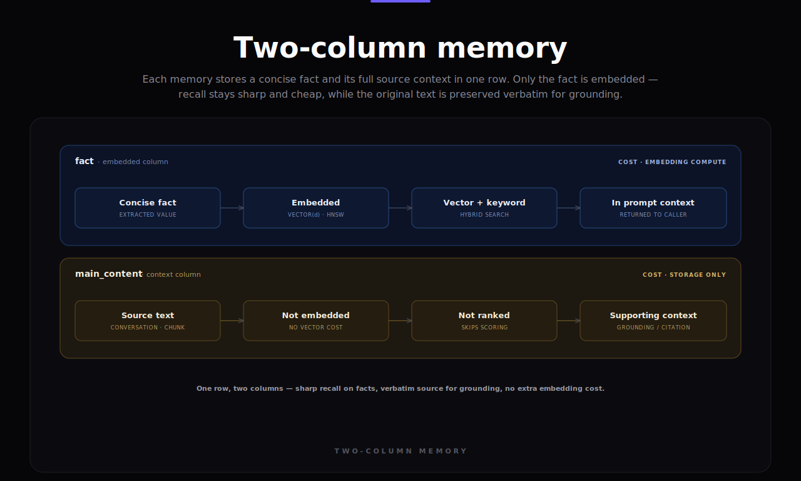

# Architecture Diagrams

## Two-Plane Memory Architecture

## Connect And Schema Initialization

## Memory Write With Policy

## Trace Recall

## Evidence Retrieval

The benchmark's reference reader (`scripts/longmemeval_harness.py`) composes
this same flow with session diversification and an evidence ledger.

## Long-Running Task Flow

## Long Input

## Database Entity View

## Two-Column Cost Model

